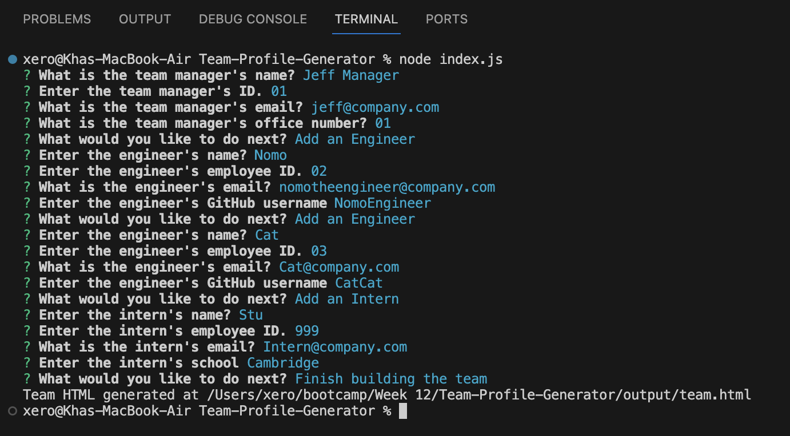
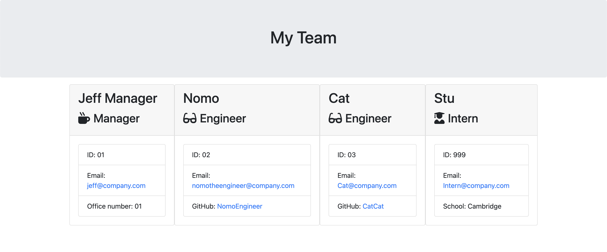

# Team-Profile-Generator

## Description

This is a Test-Driven Development (TDD) Team Profile Generator. It simplifies team profile creation through object-oriented programming and interactive command-line prompts. Utilizing JavaScript (JS), Node.js, Inquirer.js, and Jest, it ensures efficient development and testing.

## Table of Contents

- [User Story](#user-story)
- [Installation](#installation)
- [Screenshots](#screenshots)
- [Usage](#usage)
- [Deployment](#deployment)
- [Tests](#tests)
- [Questions](#questions)

## User Story

I am a developer creating a team profile genertor to create information that is easily viewed about team members.

## Installation

Users can install the project by cloning the repository from GitHub and follow these steps to install the required dependencies:

1. Initialize the project:

```bash
npm init -y
```

2. Install Inquirer for user prompts:

```bash
npm install inquirer@^8.0.0
```

3. Install Jest for testing:

```bash
npm i jest
```

4. Update test script in package.json:
   Edit the `"test"` script in the `package.json` file (line 10) to use Jest

```bash
"test": "jest"
```

5. Run tests:

```bash
npm run test
```

6. Create .gitignore file:
   Create a file named `.gitignore` to specify files and directories that should be ignored by Git. Add the following line to ignore the `node_modules` folder:

```bash
node_modules
```

## Screenshots


This screenshot shows user input for team generator.


This screenshot is the generated output.

## Usage

To use the Team Profile Generator, run the command `node index.js` in the terminal. Follow the prompts to provide information about your team, and the generator will create the `team.html` file based on your input.

1. Run the application:

```bash
node index.js
```

If you need you can:

1. Stop the application:

```bash
^C
```

2. Clear the terminal:

```bash
clear
```

## Deployment

Repository - https://github.com/Xero-N/Team-Profile-Generator
Html Sample - https://github.com/Xero-N/Team-Profile-Generator/blob/main/output/team.html

## Tests

To run Jest tests, execute the following command in the terminal:

```bash
npm run test
```


The following screenshot is the results of the results from the tests.
